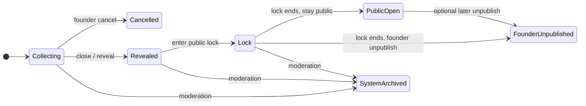

# WWW Project Phase 39 — Poll Lifecycle / Close / Reveal / Lock / Archive Policy v1

**Document path:** `docs/www-project-phase-39-poll-lifecycle-policy-v1.md`  
**Status:** Policy design (normative intent for future Phase 39 implementation; **not** implemented in this document)  
**Depends on:** `/AGENTS.md` v0.2, `docs/www-project-agent-spec-v0.1.md`, `docs/www-project-phase-40-user-profile-eligibility-follow-policy-v1.md` (eligibility and follow; orthogonal to lifecycle)  
**Baseline:** `origin/master` @ `964f39b` — chore: improve local public MVP demo startup  
**Scope of this file:** Documentation only. No database, API, frontend, or test implementation changes are implied by publishing this policy.

This document defines the **future** product and engineering policy for poll lifecycle: collecting, close, result reveal, public lock period, founder cancellation, unpublish/archive, system archive, and visibility rules for visitors, voters, and founders. It does not replace `AGENTS.md` or the agent spec.

**Related policy:** `docs/www-project-phase-40-user-profile-eligibility-follow-policy-v1.md` — user profile, voting eligibility, ineligible-user UX, and result-follow notification.

---

## 1. Context

**Public MVP today** can create polls, vote, and show result pages in a local demo. The collecting-state result API **intentionally** hides vote counts and percentages. This is a **product rule**, not a frontend bug.

Observed collecting-state result shape (Public MVP / display-safe API intent):

| Field | Collecting value | Meaning |
|-------|------------------|---------|
| `display_mode` | `collecting` | Lifecycle: aggregates withheld |
| `total_votes_display` | `收集中` | No numeric total exposed |
| `collecting` | `true` | Collecting flag for clients |
| `options[].display_count` | `null` | No per-option counts |
| `options[].display_percentage` | `null` | No per-option percentages |

After close/reveal, the API returns display-safe tiers (for example bucketed counts) per the agent spec—not raw counter rows.

**Phase 39** answers: *when* does collecting end, *when* do aggregates become public, *how long* must results stay locked from founder tampering, and *what happens* on cancel vs unpublish vs system archive.

**Phase 40** (`docs/www-project-phase-40-user-profile-eligibility-follow-policy-v1.md`) answers: *who* may vote and follow results given profile/eligibility—see §17.

---

## 2. Core definitions

| Term | Definition |
|------|------------|
| **created_at / launch time** | When the poll is published and becomes discoverable/votable per product rules. May align with start of statistics period. |
| **collecting** | Period during which eligible users may vote (Official Vote) and statistics are accumulated. **Aggregate results are not publicly shown.** |
| **statistics period** | The window during which votes count toward the poll’s official statistics, from launch (or explicit start) through **close time**. Displayed to users as a date/time range. |
| **close time** | Exact moment when **voting/statistics collection ends** and **aggregate results are revealed** to the public (MVP: close time = result reveal time). |
| **result reveal time** | Moment aggregate results become visible. **MVP:** identical to close time. **Future:** may diverge (not MVP). |
| **public lock period** | Interval **after** result reveal during which the founder **cannot** unpublish, delete, edit content, reopen voting, hide results, or change close/reveal semantics. Protects result integrity and voter trust. |
| **archive / unpublish period** | Not a separate “timer” name in MVP—refers to the **action** after lock ends when the founder removes the poll from normal public listings. Distinct from **close**. |
| **cancelled** | Founder ended the poll **before close**; no public aggregate result is formed; intermediate signals are not revealed. |
| **archived / unpublished** | Founder (post-lock) or policy removed the poll from normal homepage discovery; direct URL shows unpublished/archived state. |
| **system archived** | Platform moderation/governance/safety archival—separate from founder unpublish. |

### Semantic rules (non-negotiable wording)

1. **“Close”** means voting/statistics collection **ends** and **aggregate results are revealed**. It does **not** mean the public lock period ends.
2. **“Unpublish” / “archive” (founder)** is **not** the same as close. A poll can be closed with revealed results and still be public during lock.
3. **MVP** may treat **close time = result reveal time** (single timestamp, single user-facing event).

---

## 3. Recommended lifecycle

### Primary path

```text
Collecting
  → Closed / Results Revealed
  → Public Lock Period
  → Can Remain Public or Be Unpublished (founder choice after lock)
  → Unpublished / Archived (founder)
```

### Branches

| Branch | When | Outcome |
|--------|------|---------|
| **Cancelled before close** | Founder cancels during collecting | Voting stops; **no** public aggregate result; cancelled UX |
| **System archived** | Moderation/governance/safety | Distinct copy and rules; not founder unpublish |



---

## 4. Collecting-state result visibility

During **collecting**, the following **must not** be shown on public result surfaces (API display-safe objects and UI):

- Total votes (numeric or bucketed)
- Per-option counts or percentages
- Ranking, trends, or “leading option” signals
- Remaining participant threshold (default: hidden—see §7)
- Any signal that could steer later voters’ answer direction

This applies to:

- **Voters** (whether or not they already voted)
- **Founders**
- **Ineligible users** (Phase 40)
- **Users following for reveal** without voting

The result page should explain that results are hidden until close/reveal.

### Recommended wording

> This poll is still collecting responses. Results will be revealed at {reveal_time}. Before reveal, vote counts and percentages are hidden to avoid influencing later voters.

`{reveal_time}` should use the poll’s configured reveal time (MVP: same as close time), in a clear locale-appropriate format.

---

## 5. Close / reveal policy

| Rule | MVP | Future |
|------|-----|--------|
| Votes accepted | Until close time | Same unless policy adds grace (not MVP) |
| Aggregates visible | From reveal time onward | Reveal may be scheduled after close |
| close time vs reveal time | **Equal** | May differ |

At **close time**:

1. The poll **stops accepting** Official Votes (and statistics period ends).
2. **Aggregate results** become visible per display-safe tier rules.
3. The poll enters the **public lock period** (§8).

The UI should show **statistics period** and/or **reveal time** clearly.

### Recommended display

```text
Statistics period: 2026/06/01 12:00 – 2026/06/02 20:00
Results reveal: 2026/06/02 20:00
```

---

## 6. Close conditions

MVP and future close conditions may include:

| Condition | MVP | Future |
|-----------|-----|--------|
| **Time-based close** (exact date/time) | Yes | Yes |
| **Participant-count threshold** | Future | Yes |
| **Dual condition** (threshold **or** time, whichever first) | Future | Yes |

**Example (future / dual):**

> Close when 300 eligible votes are collected or at 2026/06/02 20:00, whichever comes first.

### Policy notes

- **Canonical value:** Store and display an **exact** close/reveal timestamp. UI “quick presets” (for example “24 hours”) must resolve to explicit date/time before save.
- **Progress leakage:** Do **not** show “remaining participant count” or “X votes until close” during collecting **by default**—these leak progress signals and can manipulate later voters.
- Founders may see configured close **condition type** in dashboard (for example “closes at 2026/06/02 20:00”) without live progress counters (§15).

---

## 7. Public lock period

After results are **revealed**, the poll enters a **public lock period**.

### Founder actions forbidden during lock

- Unpublish / archive
- Delete poll
- Modify title, description, or options
- Reopen voting
- Hide public results
- Change close time or reveal time
- Recalculate or tamper with displayed aggregates

### Allowed during lock

- View public aggregate results (same display-safe objects as other users)
- Copy / duplicate poll as a **new** poll version (new poll id; no retroactive edit of locked poll)
- Future admin typo correction / audit flows only where existing governance policy explicitly allows—and never in ways that violate lock intent without dual-admin rules

### MVP tentative lock length

- **5 days** after result reveal.

**Note:** 7 days was considered; **5 days** may be better for MVP velocity while still protecting post-reveal integrity.

**Future:** Trust level or category might shorten lock for **low-risk** categories only; **high-risk** categories must not shorten lock casually.

---

## 8. Founder cancellation before close

Before close, the founder may **cancel** the poll.

- Use **“cancel”** — not “unpublish” or “archive” — for pre-close termination.

### Cancelled poll rules

| Rule | Requirement |
|------|-------------|
| Voting | Stops immediately |
| Public aggregate result | **Not formed** / not revealed |
| Intermediate results | **Not** revealed to founder or public |
| Visitor UX | Clear cancelled state |
| Founder inference | Cancellation must **not** be usable to reveal or infer intermediate counts |

### Suggested wording

> This poll was cancelled by the founder before results were formed.

---

## 9. Unpublish / archive after lock period

After the **public lock period ends**, the founder may:

- Keep the poll **public**, or
- **Unpublish / archive** it (founder-initiated removal from normal discovery)

### Preferred wording

> This poll has ended its public lock period and was unpublished by the founder.

### Shorter wording

> This poll has ended its public lock period and was unpublished.

### MVP policy

| Rule | MVP intent |
|------|------------|
| Homepage / feed lists | Unpublished polls **do not** appear in normal homepage lists |
| Direct URL | Shows unpublished/archived state |
| Full results after unpublish | MVP **may hide** full public results after founder unpublish while preserving internal records |
| Future | Whether a **public result summary** remains visible after unpublish is open product discussion |

---

## 10. System archived

**System archived** is separate from founder unpublish.

Possible reasons (non-exhaustive):

- Moderation action
- Governance decision
- Safety takedown
- Long-term archival policy
- Policy violation

### Suggested public wording

> This poll has been archived by the system.

Do **not** expose sensitive moderation details, internal case ids, or reporter identity in default public UI.

---

## 11. Homepage / poll card visibility

| Lifecycle (card) | Show | Do not show |
|------------------|------|-------------|
| **Collecting** | Title; short description; category; status `collecting`; statistics period; result reveal time; eligibility summary (Phase 40 when available) | Vote count; percentages; ranking |
| **Revealed / public** | Title; short description; category; status results revealed / public; statistics period; **total votes** (display-safe); link to results | Raw counters |
| **Locked** (optional card hint) | Same as revealed/public; subtle “public lock period” optional on card | Lock legal text can live on result page |
| **Unpublished** | — | **Excluded** from normal homepage lists by default |

---

## 12. Voting page visibility

### Show

- Title, description, category
- Options (if user is **eligible** and poll is **collecting**)
- Statistics period
- Reveal time
- Result visibility rule (results hidden until reveal)
- Eligibility block (Phase 40): requirements, eligible/not, reason, follow-result when applicable

### Do not show (collecting)

- Total votes
- Option counts or percentages
- Participant count
- Remaining participant threshold (default off)
- Trends or ranking

---

## 13. Result page states

Each state defines: results visible?, voting allowed?, notice, primary action.

| State | Results visible? | Voting? | Notice (summary) | Primary action (if any) |
|-------|------------------|---------|------------------|-------------------------|
| **collecting / voted** | No aggregates | No (already voted; no change vote in MVP unless spec says otherwise) | Collecting + reveal time; thanks for voting | View poll info; optional follow notify (Phase 40) |
| **collecting / unvoted** | No aggregates | Yes if eligible | Collecting + reveal time; counts hidden | Vote (if eligible); follow result (Phase 40) |
| **collecting / ineligible** | No aggregates | No | Eligibility not met; counts hidden | Follow result (Phase 40) |
| **collecting / followed** | No aggregates | Yes if eligible and not yet voted | Following for reveal | Cancel follow; vote if eligible |
| **results revealed** | Yes (display-safe) | No | Results public as of {reveal_time} | Share / view breakdown per tier |
| **public lock period** | Yes | No | Results public; founder cannot edit during lock | — |
| **lock ended, still public** | Yes | No | Poll remains public | — |
| **unpublished after lock** | MVP may hide full results | No | Unpublished copy (§9) | — |
| **cancelled before close** | No | No | Cancelled copy (§8) | — |
| **system archived** | Per governance (often none or minimal) | No | System archived copy (§10) | — |

Collecting states must use API/UI consistent with §1 (`display_mode: collecting`, null option display fields).

**Phase 40 cross-reference:** Ineligible and follow behaviors must not bypass collecting result hiding—see `docs/www-project-phase-40-user-profile-eligibility-follow-policy-v1.md` §6–§10.

---

## 14. Founder dashboard visibility

### During collecting — founder **may** see

- Title
- Status (collecting)
- Statistics period
- Result reveal time
- Configured close condition **type** and scheduled close time (not live progress)
- Eligibility settings (Phase 40)
- Share links
- **Cancel** action (if allowed)

### During collecting — founder **must not** see

- Current vote count
- Current participant count
- Option counts or percentages
- Ranking or trends
- Demographic trends
- Follower count (if it leaks progress)
- Remaining participant threshold (if it leaks progress)

### After reveal

- Founder sees **public aggregate result** (display-safe, same tier rules as visitors).
- **During lock:** cannot unpublish, delete, modify, reopen, or hide results (§7).
- **After lock:** may unpublish/archive per §9 if policy allows.

---

## 15. UI wording notes

### Privacy / anonymity

Avoid:

- ❌ “anonymous submission, contains no personal information”

Prefer:

- ✅ “anonymous submission; personal data is not publicly shown”
- ✅ “Voting does not publicly reveal personal data or individual voting records.”

### Lifecycle terms

Avoid confusing synonyms:

| Avoid | Prefer when meaning |
|-------|---------------------|
| “expired” | “lock period ended” or “statistics period ended” (be specific) |
| “closed” alone | “results revealed” vs “voting ended” vs “unpublished” (use precise state) |
| “archived” | “cancelled before results formed” vs “founder unpublished” vs “system archived” |

---

## 16. MVP vs future

| Area | MVP (Phase 39 intent) | Future |
|------|------------------------|--------|
| Collecting hides results from **everyone** | Yes | — |
| close time = reveal time | Yes | Separate reveal scheduling |
| Exact date/time close | Yes | — |
| Public lock period | **5 days** after reveal | Category/trust-dependent length |
| Founder cancel before close | Yes | — |
| Founder unpublish after lock | Yes | Public summary after unpublish TBD |
| Result page state notices | Yes | Richer notifications |
| No intermediate participant/progress signals | Yes | Threshold close may need careful UX |
| Participant-count close | No | Yes |
| Dual close (time OR count) | No | Yes |
| Correction/audit during lock | Only via existing governance | Tighter integration |
| High-risk category lock shortcuts | No shortening | Stricter governance |

---

## 17. Alignment with Phase 40

| Document | Responsibility |
|----------|----------------|
| **Phase 39** (this file) | Poll lifecycle, close/reveal, lock, cancel, unpublish, system archive; visibility **by poll state** |
| **Phase 40** (`docs/www-project-phase-40-user-profile-eligibility-follow-policy-v1.md`) | User profile, age/region eligibility, ineligible UX, follow-result notification; visibility **by user eligibility** |

**Implementation must satisfy both:**

1. **No collecting-stage result leakage** for any viewer (voter, founder, ineligible, follower).
2. **Ineligible / followed users** may see basic poll info and later **public** results after reveal, but never collecting-stage aggregates (Phase 40 §6).
3. **Founders** cannot see intermediate signals during collecting (Phase 39 §14; Phase 40 §11).
4. **Ranking / feed** must not use answer-direction or collecting progress to manipulate pre-vote discovery (`AGENTS.md` §7).

When Phase 39 and Phase 40 are implemented, handoff documents should cite both files and any agent spec deltas.

---

## 18. Privacy and integrity checklist (Phase 39 implementation gate)

1. Collecting API returns `display_mode: collecting` and withholds counts—not a client-side omission only.
2. Close triggers reveal (MVP) without exposing pre-close snapshots that allow user-level option reconstruction.
3. Lock period enforcement blocks founder tampering paths (§7).
4. Cancel does not leak intermediate aggregates (§8).
5. Unpublish and system archive use distinct user-facing copy (§9–§10).
6. No new logs/metrics pair option choices with users during lifecycle transitions.

---

## 19. Document validation note

This file is **docs-only**. It does not alter schema, migrations, APIs, frontend bundles, or tests. No commit or push is implied by adding this policy.
